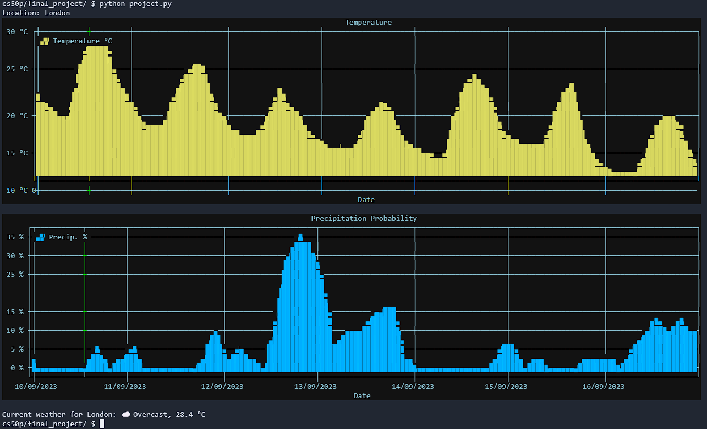
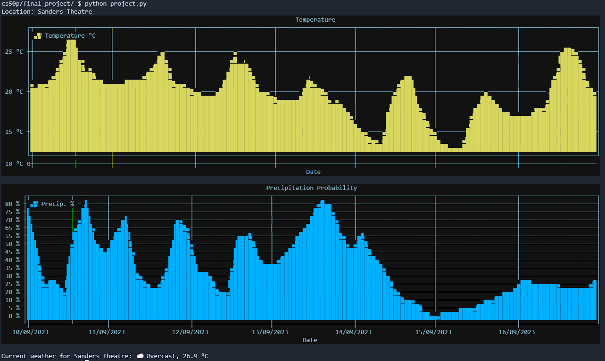
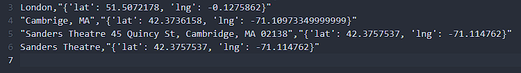

# CLI Weathercast
### Video Demo:  <https://youtu.be/zeEN8YsVmuQ>
### Description:
CLI Weathercast is my final project for Harvard's CS50P course.

I wanted to utilize most of the things taught in CS50P, including not only basic syntax, but also using CSV files, pulling data from APIs and working with third-party libraries.

Once run, the program will prompt the user for a location they wish to check weather for and, if it can find it, respond with graphs showing temperature and probability of precipitation for the next week.

Current time will be marked with a green line on the graph. In addition, it'll also print the current weather (for example "☀️  Clear sky" or "⛈️⚠️  Thunderstorm") and temperature.

### Location matching
Function `get_coords()` inside locate.py handles maching user input to actual location. On a success, it returns a dictionary containing latitude and longitude, otherwise it returns `False`.

Location is matched using Google's Geocoding API - as such, the user is not limited to just major cities.

We can even check the weather before our next CS50x lecture:

Endlessly calling the Google Maps API can cost us a few cents though. To reduce the number of API calls, the program will build a simple, persistent database of locations in a CSV file. After each API call, it'll add a new line to the file, storing the name, as well as latitude and longitude. In the future, it'll check its local database before trying to get data from API.

### Getting forecast
Once we know the latitude and longitude, we can get ourselves a forecast. CLI Weathercast uses free API of [https://open-meteo.com](https://open-meteo.com) to get hourly forecast for the week.

This API call is handled by `get_weather()` function inside main project.py file. On a success, it'll return a JSON object containing the forecast, otherwise it'll retry 10 times before exiting the program.

Next, various datapoints will be extracted, including timestamps, temperatures, precipitation probability and weathercode.

Additionally, timestamps need to be converted from `yyyy-mm-ddThh:mm` to `dd/mm/yyyy hh:mm:00` before being passed to graphs-creating functions. This is handled by `convert_time()` function

### Drawing graphs
Temperature and Precipitation Probabilty graphs are drawn using the [plotext library](https://pypi.org/project/plotext/). Specific functions are stored in graphs.py:

`prep_plot()` Handles graph preparation - setting up colors, grid, labelling the X axis with dates and marking the current time

`clear_plot()` Clears the data to prepare for the next graph

`plot_temp()` Draws the temperature graph

`plot_precipitation()` Draws the precipitation probability graph

### Current weather
Finally, we need to output the **current** weather. This is handled by `get_current_weather()` inside project.py.

First off, the function gets the current time (rounded to the nearest full hour) from `get_current_time()` inside timecalc.py and matches it against the list of timestamps in the forecast. Once it finds a match, it grabs the temperature and weathercode for the matching index, converts the weathercode to specific weather type using `get_weather_status()` inside weathercodes.py, and returns it all as formatted string.

### Credits
[Google Geocoding API](https://developers.google.com/maps/documentation/geocoding/overview)

[Open Meteo Weather API](https://open-meteo.com)

[plotext library](https://pypi.org/project/plotext/)
